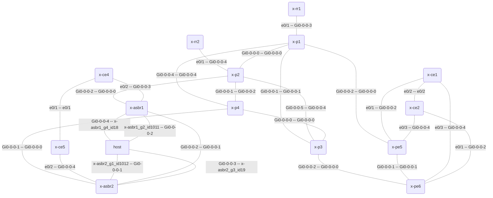

# Containerlab Topologies

### new-xrd-ubuntu0.clab.yaml

```mermaid
graph TD
    x_p1("x-p1")
    x_p2("x-p2")
    x_p3("x-p3")
    x_p4("x-p4")
    x_asbr2("x-asbr2")
    x_asbr1("x-asbr1")
    x_pe5("x-pe5")
    x_pe6("x-pe6")
    x_rr1("x-rr1")
    x_rr2("x-rr2")
    x_ce1("x-ce1")
    x_ce2("x-ce2")
    x_ce4("x-ce4")
    x_ce5("x-ce5")
    x_rr1 -.- |e0/1 -- Gi0-0-0-3| x_p1
    x_rr2 -.- |e0/1 -- Gi0-0-0-4| x_p2
    x_p1 -.- |Gi0-0-0-0 -- Gi0-0-0-0| x_p2
    x_p1 -.- |Gi0-0-0-1 -- Gi0-0-0-1| x_p3
    x_p1 -.- |Gi0-0-0-2 -- Gi0-0-0-0| x_pe5
    x_p1 -.- |Gi0-0-0-4 -- Gi0-0-0-4| x_p4
    x_p2 -.- |Gi0-0-0-2 -- Gi0-0-0-0| x_asbr1
    x_p2 -.- |Gi0-0-0-1 -- Gi0-0-0-2| x_p4
    x_p2 -.- |Gi0-0-0-5 -- Gi0-0-0-4| x_p3
    x_p4 -.- |Gi0-0-0-1 -- Gi0-0-0-0| x_asbr2
    x_p4 -.- |Gi0-0-0-0 -- Gi0-0-0-0| x_p3
    x_p3 -.- |Gi0-0-0-2 -- Gi0-0-0-0| x_pe6
    x_pe5 -.- |Gi0-0-0-1 -- Gi0-0-0-1| x_pe6
    x_asbr2 -.- |Gi0-0-0-2 -- Gi0-0-0-1| x_asbr1
    x_ce1 -.- |e0/1 -- Gi0-0-0-2| x_pe5
    x_ce1 -.- |e0/2 -- e0/2| x_ce2
    x_ce1 -.- |e0/3 -- Gi0-0-0-4| x_pe6
    x_ce2 -.- |e0/1 -- Gi0-0-0-2| x_pe6
    x_ce2 -.- |e0/3 -- Gi0-0-0-4| x_pe5
    x_ce4 -.- |e0/2 -- Gi0-0-0-3| x_asbr1
    x_ce4 -.- |e0/1 -- e0/1| x_ce5
    x_ce5 -.- |e0/2 -- Gi0-0-0-4| x_asbr2
    x_asbr1 -.- |Gi0-0-0-4 -- x-asbr1_g4_id18| host
    x_asbr2 -.- |Gi0-0-0-3 -- x-asbr2_g3_id19| host
    host -.- |x-asbr1_g2_id1011 -- Gi0-0-0-2| x_asbr1
    host -.- |x-asbr2_g1_id1012 -- Gi0-0-0-1| x_asbr2
```

